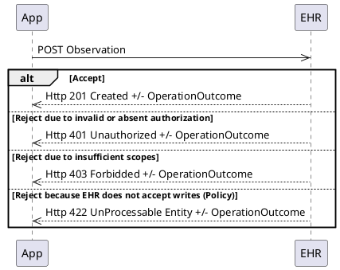
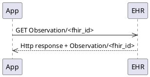

<!-- Enter your content here -->

the Argo Write API follows the [FHIR RESTful *creates* and *reads*](http://hl7.org/fhir/http.html) as described in the FHIR specification.  <!--The pros and cons of this approach are summarized [here](http://hl7.org/fhir/workflow-ad-hoc.html#optiona)-->

### Create

<!--
Request:
~~~
POST [base]/Observation
{"resourceType": "Observation",
....
}
~~~
Response:
~~~
HTTP/1.1 201 Created
...
{"resourceType": "OperationOutcome",
....
}
~~~
-->

### Read / Search

<!--
Request:
~~~
GET [base]/Observation/foo
~~~
Response:
~~~
HTTP/1.1 200 Success
...
{"resourceType": "Observation",
....
}
~~~
-->
