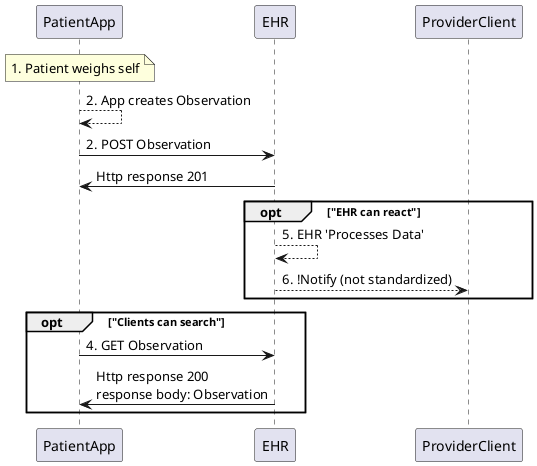

### Use Case 1: Solicited Weight Submissions

<!-- Enter your content here -->
This simple example introduces the proposed metadata in a patient supplied wt observation.

#### Description

Patient X has heart failure.  Provider Y is interested in tracking her weight over time, and being alerted about any sudden increases that could indicate fluid retention. Provider instructs patient to tracks her weight to submit it through a prescribed device portal or phone app to her provider.

#### Assumptions/Preconditions:

- Provider submits an order (provisions an app)
- Patient is provided an app (gateway) and a "WiTscale S200 Bluetooth" bluetooth enabled scale and instructed how to use
- Provider records the scale and app identifiers in their system
- Patient app has proper authorization and patient write scopes to the EHR
- Patient is provided a *Data Submission Key*. It represents fulfillment of a data request and can be referenced from the Observation.
- Patient app has proper authorization and patient write scopes to the EHR
- Patient app directly writes to EHR ("unsupervised" data)
- The server accepts all the data for review based on established policy
- The healthcare providers  explain to patients at authorization time, "hey, you want to allow this app to write data? That's fine but keep in mind we don't guarantee we'll review it in a timely fashion..."
- **Resources are submitted one at a time and not as a Bundle** (see [Questions](/UG_Lai1iRaC2posiQzl0zw#Questions))
- Patient's can access data (see [FRC-2 and 3]([/WwsA0bNWSQ2OS5zbJFM_rw?view](https://hackmd.io/WwsA0bNWSQ2OS5zbJFM_rw?view)))
- Argo Write rate limits in place as needed

---

#### Sequence Diagram

##### Steps

1. Patient uses a “WiTscale S200 Bluetooth” bluetooth enabled scale to weighs self
2. The App creates a FHIR Observation Example resource with a reliability tag and submission key and device data and extension indicating the data was directly read from the device vs being hand-entered:
    - See below
3. The patient instructs the connected App to POST her weight to her EHR. The app uses the FHIR RESTful API to do this.
4. The patient may decide to fetch her weight data to review and instructs the app to fetch it.  The app uses the FHIR RESTful API to do this.
5. Based on its policy, the EHR 'Processes' the patient submitted wts.  For example it may store, delete summarize or 6. may notify the provider (not standardized)

##### Example resource with a reliability tag and submission key and device data and 'modality' extension:



##### Reliability Tag 
 
In order for the EHR to know that this is patient submitted data, at a bare minimum a *Reliability Tag* is required.
- Technically a `Coding` datatype on the `meta.tag` element 
- FHIR searches find resources with this tag by default; clients that don't want them can filter them out, through search params
- Providers and EHRs can do what they want with these data (e.g., leaving them tagged; reviewing and adding a provider-reviewed tag; reviewing and stripping the patient-supplied tag; deleting them...)

system = `http://www.fhir.org/guides/argonaut/argo-write/CodeSystem/tags`

|Code|Display|Definition|
|---|---|---|
|`patient-supplied`|Patient Supplied Data|Data is supplied by patient - either patient generated data or data generated elsewhere and forwarded by patient (todo get references to definitions of PGD)|
|`provider-reviewed`|Provider Reviewed Data|Data is supplied by patient and has been reviewed by provider ( either manully or through some automated fashion)|

###### Discussion...

:thinking_face: Why [`meta.tag`](http://hl7.org/fhir/R4/resource-definitions.html#Meta.tag)? :raising_hand: Standard FHIR search works "out-of-the-box".

:thinking_face: Who is supporting `meta.tag` today?

:thinking_face: What about using [`meta.security`](http://hl7.org/fhir/R4/resource-definitions.html#Meta.security)
  - existing valueset [V3 Value SetSecurityIntegrityObservationValue](http://hl7.org/fhir/v3/SecurityIntegrityObservationValue/vs.html)

:thinking_face: Should the App (data source) or EHR (data consumer) apply the tag?

---

##### "Submission Key" 
 
In addition to decorating the resource with reliability data, the resource can be identified as being solicited or ordered via a *Submission Key*. This is an identifier that can directly or indirectly refer back to the order for data. 

- Providers and EHRs can are able to match the patient submitted data to a particular request using the `basedOn` element.
- Technically a `Reference` datatype on the [`basedOn`](http://hl7.org/fhir/observation-definitions.html#Observation.basedOn) element which references the order that this Observation fulfills.
    - It can be a FHIRid, or a  business identifier.
- Through standard search parameters, FHIR searches can find resources that are linked to an order. 

Each time a new weight measurement is recorded, the app POSTs it to the EHR, populating `Observation.basedOn` with a link to the Order Identifier in step 2.

###### Discussion...

:thinking_face: Who supports the `basedOn` element today?

:thinking_face: What would `basedOn` refer to if fhir_id? :woman-raising-hand: For patient reported observations, most commonly `ServiceRequest`. `Task` or other request resources could be potential targets depending on the type of data submitted.

:thinking_face: Should Argo write support fhir_id, business identifers and free text options or limit to first two or only fhir_ids?

:thinking_face: What about 'unsolicited' data.  :man-raising-hand: See this sidebar on [Changing Unsolicited to Solicited Writes](/-cUGDSa5RWOSYx6c9C-Oqg#Changing-Unsolicited-to-Solicited-Writes) on turning 'usolicited' data into 'solicited' data

---

##### Device Data

In addition to decorating the resource with reliability data and the Submission Key the resource can provide different amounts of provenance. The [`device`](http://hl7.org/fhir/observation-definitions.html#Observation.device) element is one simple way to represent data provenance specifically for Observations.

- Clients can represent what entity is the source of the data using the `device` element.
- Technically a `Reference` datatype which may identify the device ( e.g, the provisioned scale) which took the measurement ( weight)
- It can be a FHIR_id, and/or a business identifier and/or text string.
 
For example in step 2 above, each time a new weight measurement is recorded, the app POSTs it to the EHR, populating `device` with a provider supplied FHIR_id, UUID, or display for the provisioned device.  The provider would then be able to use this information to identify the device used.

###### Discussion

:thinking_face: Is the gateway's (a.k.a., phone app's) provenance important - i.e., does the provider want both the measurement device and the gateway? :woman-raising-hand:  If the answer is 'yes', then consider using the full Provenance resource discussed below.

:thinking_face: Does the provider already know the app through the authorization step?

:thinking_face: (same as above) Should Argo write support fhir_id, business identifers and free text options or limit to first two or only fhir_ids?

---

##### Provenance

[Provenance](http://hl7.org/fhir/provenance.html) is the most thorough and complete way to represent data provenance. It tracks information about the activity that created, revised, deleted, or signed a version of a resource, describing the entities and agents involved.

- Technically a `Provenance` resource that reference the patient supplied resource (e.g., Weight Observation)
- can represent the device, gateway app, who performed ( e.g., patient or caretaker) etc
Each time a new weight measurement is recorded, the app POSTs it to the EHR, along with a Provenance resource

Example Provenance resource with a target Observation, Device, Gateway App, Performer :



#### Discussion...

:thinking_face: how would an app would pass along a Provenance?
 - separate transactions
 - *contained* Provenance resource.
 - Post a transaction bundle
  
:thinking_face: extending the use case if an observations from an outside Health system uploaded by the patient's app, would the app have to POST a Practitioner and an Organization to the receiving EHR, and then update the Provenance to insert the new IDs of these elements?
 - reference could be replaced with display names or *contained* resources.

:thinking_face: is this too heavy an approach?

---
  
##### Modality Extension

This **optional** extension would represent if the data entered by patient or directly uploaded from the device

orginally defined here: [OMH](https://healthedata1.github.io/mFHIR/StructureDefinition-extension-modality.html)

uri: `http://www.fhir.org/guides/omhtofhir/StructureDefinition/extension-modality`

*NOTE: This extension was originally defined to go on the device element, but think is better on the Obervation*

|Code|Display|Definition|
|---|---|---|
|`sensed`|Sensed|Device measurement is sensed directly by the device|
|`self-reported`|Self Reported|Device measurement is entered by the user|

###### Discussion...

:thinking_face: Would it be more consistent to use `meta.tag` (or `meta.security`) approach as we are proposing for 'reliability' tagging?

---
