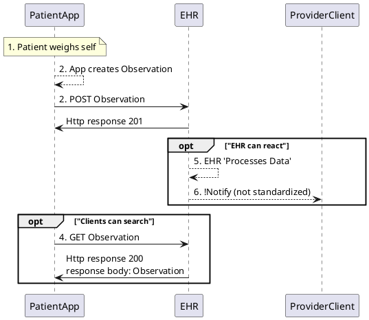

<!-- Enter your content here -->
This simple example introduces the proposed metadata in a patient supplied wt observation.

#### Description

Patient X has heart failure.  Provider Y is interested in tracking her weight over time, and being alerted about any sudden increases that could indicate fluid retention. Provider instructs patient to tracks her weight to submit it through a prescribed device portal or phone app to her provider.

#### Assumptions/Preconditions:

- Provider submits an order (provisions an app)
- Patient is provided an app (gateway) and a "WiTscale S200 Bluetooth" bluetooth enabled scale and instructed how to use
- Provider records the scale and app identifiers in their system
- Patient app has proper authorization and patient write scopes to the EHR
- Patient is provided a *Data Submission Key*. It represents fulfillment of a data request and can be referenced from the Observation.
- Patient app has proper authorization and patient write scopes to the EHR
- Patient app directly writes to EHR ("unsupervised" data)
- The server accepts all the data for review based on established policy
- The healthcare providers  explain to patients at authorization time, "hey, you want to allow this app to write data? That's fine but keep in mind we don't guarantee we'll review it in a timely fashion..."
- **Resources are submitted one at a time and not as a Bundle** (see [Questions](/UG_Lai1iRaC2posiQzl0zw#Questions))
- Patient's can access data (see [FRC-2 and 3]([/WwsA0bNWSQ2OS5zbJFM_rw?view](https://hackmd.io/WwsA0bNWSQ2OS5zbJFM_rw?view)))
- Argo Write rate limits in place as needed

---

#### Sequence Diagram

##### Steps

1. Patient uses a “WiTscale S200 Bluetooth” bluetooth enabled scale to weighs self
2. The App creates a FHIR Observation Example resource with a patient-supplied tag and submission key and device, gateway and performer data and extension indicating the data was directly read from the device vs being hand-entered:
    - See below
3. The patient instructs the connected App to POST her weight to her EHR. The app uses the FHIR RESTful API to do this.
4. The patient may decide to fetch her weight data to review and instructs the app to fetch it.  The app uses the FHIR RESTful API to do this.
5. Based on its policy, the EHR 'Processes' the patient submitted wts.  For example it may store, delete summarize or 6. may notify the provider (not standardized)

##### Example resource with a patient-supplied tag and submission key and device data and 'modality' extension:



---
