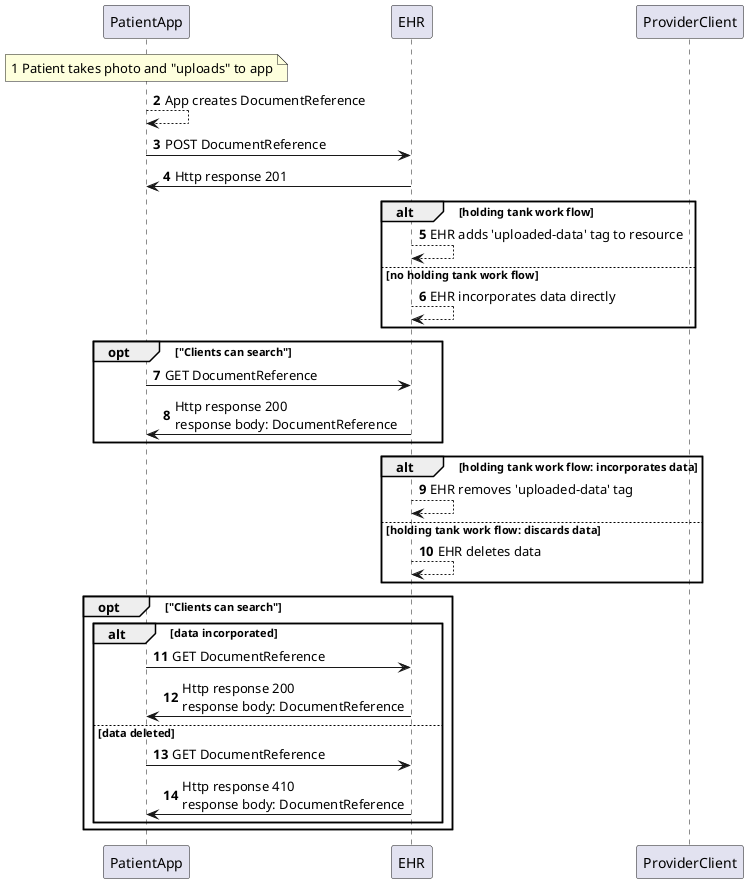

#### Description

This simple example uses the Argo Write API to submit a patient supplied wound photo to her provider using the FHIR DocumentReference resource.

#### Assumptions/Preconditions:

- Provider requests the patient submit a photo through a provisioned app
- Patient is provided an app (gateway) and instructed how to use
- Patient app has proper authorization and patient write scopes to the EHR
- Patient is provided a *Data Submission Key*. It represents fulfillment of a data request and can be referenced from the DocumentReference.
- Patient app has proper authorization and patient write scopes to the EHR
- Patient app directly writes to EHR ("unsupervised" data)
- The server accepts all the data for review based on established policy
- The healthcare providers  explain to patients at authorization time, "hey, you want to allow this app to write data? That's fine but keep in mind we don't guarantee we'll review it in a timely fashion..."
- **Resources are submitted one at a time and not as a Bundle** (see [Questions](/UG_Lai1iRaC2posiQzl0zw#Questions))
- Patient's can access data (see [FRC-2 and 3]([/WwsA0bNWSQ2OS5zbJFM_rw?view](https://hackmd.io/WwsA0bNWSQ2OS5zbJFM_rw?view)))
- Argo Write rate limits in place as needed

---

#### Sequence Diagram

##### Steps

1 Patient takes photo of wound and "uploads" to app

2 The App creates a FHIR DocumentReference Example resource with a submission key, performer and image data as inline base64 data.
    - See below
    
3,4 The patient instructs the connected App to POST the image to her EHR. The app uses the FHIR RESTful API to do this.

5 if the EHR's workflow requires some processing before the resource is incorporated into the patient record, the EHR will add the "uploaded-data" tag to the resource.

6 The EHR may directly incorporate the resource into the patient record. In this case, there will not be a tag.

7.8 The patient may decide to fetch her data to review and instructs the app to fetch it.  The app uses the FHIR RESTful API to do this. The resource may have the "uploaded-data" tag if the EHR's workflow requires some processing before the resource is incorporated into the patient record.  If it it directly incorporated into the patient record there will not be a tag. 

9 Based on its policy, the EHR processes and incorporates the patient submitted data and the "uploaded-data" tag is removed from the resource. 

10 The EHR may ultimately decide to delete the data

11-14 The patient may decide to fetch her data to review and instructs the app to fetch it.  The app uses the FHIR RESTful API to do this. Because the patient data is incorporated into the patient record, there will not be a tag.  If the data has been deleted, the EHR will return a 410 HTTP status code to indicate that the resource is no longer found.

##### Example resource with uploaded-data tag and submission key, performer and image data as inline base64 data:


